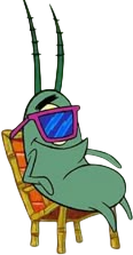

##  안녕하세요 프로덕트 엔지니어 신이현 입니다

끊임없는 도전으로 성장하는 개발자 신이현입니다. 
잘 동작하는 코드를 넘어, 사용자의 문제를 데이터로 읽고 해결책을 설계하는 개발을 지향합니다. 
기획부터 백엔드·인프라까지 서비스 전반을 경험하며 실제 사용자의 문제를 해결하는 개발을 고민해 왔습니다.

<h3>🖥️ Technologies</h3>

<h3>🏆 Awards</h3>

  • [2026] 제 12회 선린 해커톤 금상 (1등) 
  • [2025] Daangn Builder's Camp 해커톤 우승 (1등) 
  • [2025] 디지털 콘텐츠 개발 대회 생활 부문 금상 (1등) 
  • [2025] 제 11회 선린 해커톤 은상 (2등) 
  • [2025] U/THON 우수상 (2등) 
  • [2025] 제 15회 e-ICON 세계대회 본선 진출 
  • [2024] 동행 해커톤 KOSAC 이사장상 (2등) 
  • [2024] AppJam 미래산업 부문 최우수상 (1등) 
  • [2024] STA+C 가작상 (결선) 

<h3>💼 Experience</h3>

  • [2026] (주)당근마켓 - Local Jobs 프론트엔드 개발 
  • [2025] 인피니티텐서(주) - 풀스택 개발

<h3>📡 Follow Me</h3>

